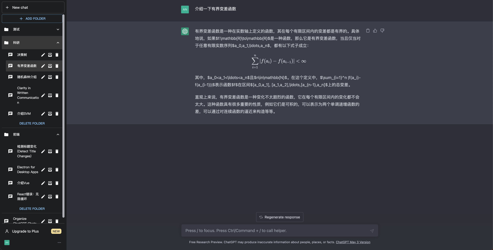
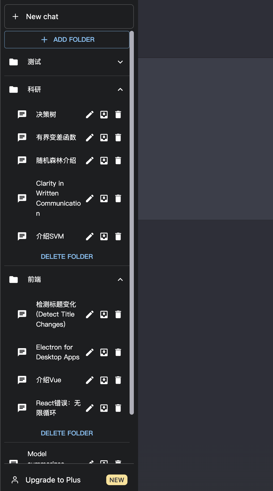

# ChatGPT Chat Organizer

This GreasyFork script provides a convenient way to organize chats within ChatGPT by allowing users to create and customize folders for efficient chat management.

## Usage Instructions

1. Install a userscript manager like Tampermonkey or Greasemonkey in your web browser.
2. Install the "ChatGPT Chat Organizer" script from [GreasyFork](https://greasyfork.org/en/scripts/465902-chatgpt-chat-organizer).
3. Create a folder and add chats to it by clicking on the "Move" button in the chat window.

## Example

After installing this script, your chat window will be like:



## Highlights

- **Efficient Chat Organization:** The script enables users to organize their ChatGPT conversations into personalized folders, facilitating better chat management and easy access to specific chats.
- **Customizable Folder Creation:** Users have the flexibility to create new folders with custom names, tailoring the organization system to their preferences and needs.
- **Clean and Readable Interface:** The script enhances the user experience with a clean and intuitive interface, ensuring readability and ease of navigation.

## Technical Details

- The script is developed using vite-plugin-monkey + react + mui.
- The folders are stored in the local storage of the browser. If you want to clean the folder list, you can clear as follows:
```javascript
localStorage.removeItem('organizedChats');
```

## Additional Information

- This script is compatible with the latest version of ChatGPT and is regularly updated to ensure compatibility with future versions.
- For support or to report any issues, please visit the script's page on GreasyFork and leave a comment or contact the author.

Enjoy a clutter-free and organized ChatGPT experience with the ChatGPT Chat Organizer script!